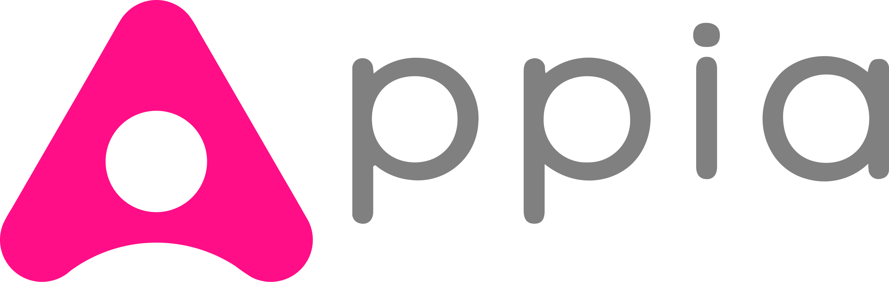
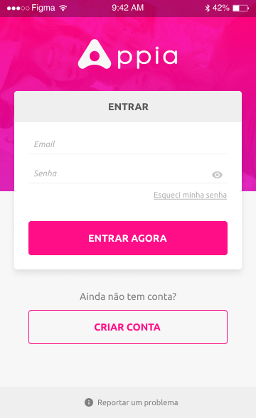
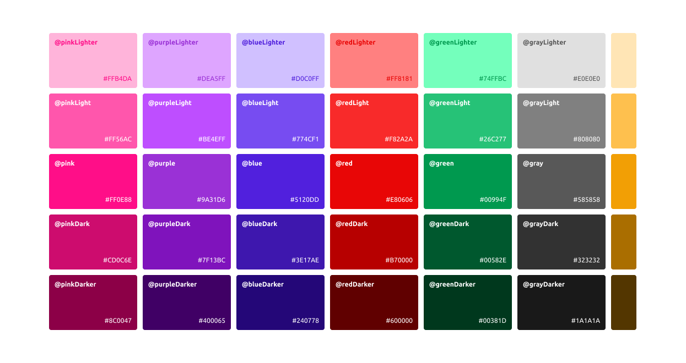
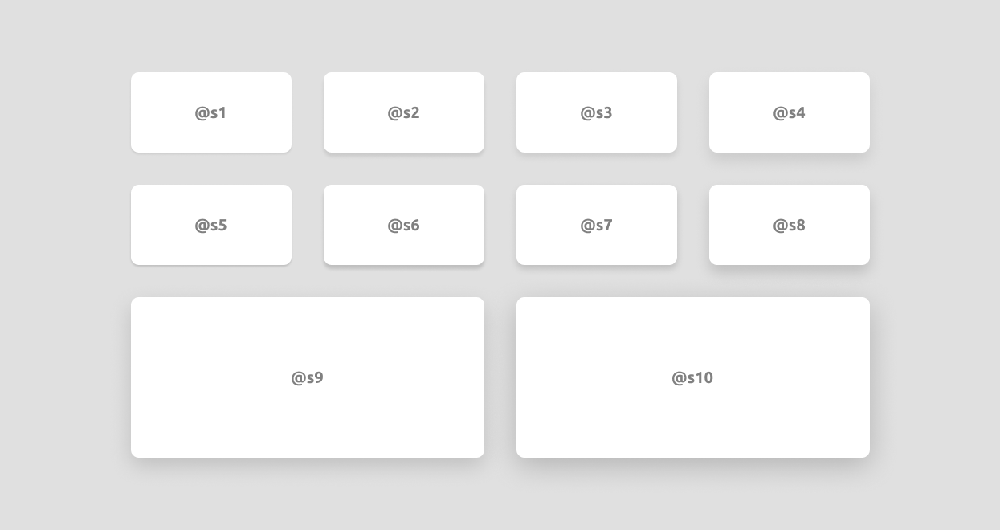
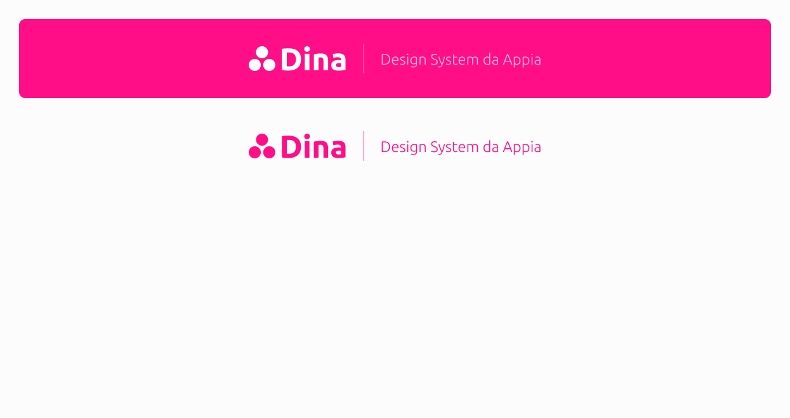

# AppiaCare — Design System

A cross-platform design system for AppiaCare's mobile and web applications, built on [Material Design](https://material.io) principles.

> **Idioma / Language:** This document is written in English. Portuguese-specific terms are preserved where they reflect the original design vocabulary.

---

## Table of Contents

- [Overview](#overview)
- [Design Foundation](#design-foundation)
  - [Material Design](#material-design)
  - [Alternative Design Systems](#alternative-design-systems)
- [AppiaCare Design Specifications](#appiacare-design-specifications)
  - [Screen Examples](#screen-examples)
  - [Color Palette](#color-palette)
  - [Elevations](#elevations)
  - [Contrast](#contrast)
- [Developer Resources](#developer-resources)

---

## Overview

AppiaCare's design system provides a shared visual language and component library that ensures consistency across Android, iOS, and Web platforms. It is not tied to any single platform — it is a set of principles and reusable patterns.

---

## Design Foundation

### Material Design

AppiaCare is built on [Material Design](https://material.io), a visual language that synthesizes the classic principles of good design with the innovation of technology and science. Components are designed to work across Android, iOS, and Web.

### Alternative Design Systems

The following design systems were evaluated during the creation of AppiaCare's system and serve as complementary references:

#### Microsoft Fluent Design System

[Fluent Design](https://www.microsoft.com/design/fluent/) brings principled design, technology innovation, and customer needs together into a shared, open design system across platforms.

#### Apple Human Interface Guidelines (iOS)

[iOS Design Themes](https://developer.apple.com/design/human-interface-guidelines/ios/overview/themes/) define three primary principles:

- **Clarity** — Text is legible at every size, icons are precise and lucid, and a focus on functionality motivates the design. Negative space, color, fonts, and graphics subtly highlight important content and convey interactivity.
- **Deference** — Fluid motion and a crisp interface help people understand and interact with content without competing with it. Minimal bezels, gradients, and drop shadows keep the interface light while ensuring content is paramount.
- **Depth** — Distinct visual layers and realistic motion convey hierarchy and facilitate understanding. Touch and discoverability enable access to functionality and additional content without losing context.

---

## AppiaCare Design Specifications

Full design specifications are available in [Figma](https://www.figma.com/file/VGyJJPy7HHfHLGCe1BZ90e/Appia-Design-System).

Key benefits of using the design system:

- **Consistency** — Uniform appearance and behavior across all platforms.
- **Efficiency** — Reusable components reduce development time and effort.
- **Accessibility** — Tested contrast ratios and readable typography ensure usability for all users.

### Screen Examples

### Color Palette

### Elevations

### Contrast

Contrast is used to establish visual hierarchy and guide user attention. Examples include:

| Contrast Type | Purpose |
|---|---|
| Dark / Light | Background and surface differentiation |
| Bold / Regular | Typographic emphasis |
| Urgent / Not Urgent | Priority signaling |
| Primary / Secondary Actions | Action hierarchy in UI |

---

## Developer Resources

Platform-specific implementation guides for Material Design components:

| Platform | Documentation |
|---|---|
| Android | [material.io/develop/android](https://material.io/develop/android/) |
| iOS | [material.io/develop/ios](https://material.io/develop/ios/) |
| Web | [material.io/develop/web](https://material.io/develop/web/) |
